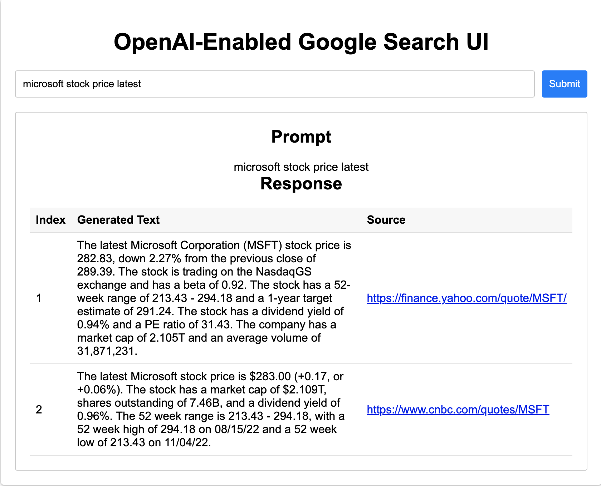

# Google Search and OpenAI Integration Demo

This project demonstrates the power of combining Google Search and OpenAI's GPT engine to generate accurate and up-to-date information from the top search results. By leveraging the extensive search capabilities of Google and the natural language processing of OpenAI, this demo aims to provide users with relevant information that is both current and reliable.

## Key Features

- Google Custom Search API and unofficial Google Search library integration
- OpenAI API integration
- Prompt engineering techniques
- Flask-based REST API for seamless frontend-backend communication

One of the main limitations of the OpenAI GPT is that it is only trained on data till Sept 2021 and so it cannot answer the questions happened after that. In this project, we utilize the Google Custom Search API (or the unofficial Google Search library) to fetch up-to-date search results, and then use OpenAI to generate prompts, resulting in accurate and concise information along with their respective sources.

GPT-4 Sample output


Google Integrated Sample Output



## Table of Contents

1. [Getting Started](#getting-started)
    - [Prerequisites](#prerequisites)
2. [Installation](#installation)
3. [Configuration](#configuration)
    - [Google Custom Search API Integration and Configuration](#google-custom-search-api-integration-and-configuration)
4. [Usage](#usage)
5. [Project Structure](#project-structure)
6. [Further Reading](#further-reading)
7. [License](#license)
8. [Warning: OpenAI API Costs](#warning-openai-api-costs)

## Getting Started

These instructions will help you set up and run the project on your local machine.

### Prerequisites

- Python 3.6 or higher
- Flask
- googlesearch-python
- BeautifulSoup
- Node.js (for serving the frontend). You can install from [here](https://nodejs.org/en/download/).
- An OpenAI API key (Sign up for an account at [OpenAI](https://beta.openai.com/signup/) and obtain an API key)

## Installation

1. Clone the repository:

    ```bash
    git clone https://github.com/Sreekiranar/GPT_enabled_google_ui
    cd cd GPT_enabled_google_ui
    ```

2. Install the required Python packages:

    ```bash
    pip install -r requirements.txt
    ```

3. Install the `http-server` package for serving the frontend:

    ```bash
    npm install -g http-server
    ```

## Configuration

Update the `app.py` file with your OpenAI API key:

```python

# Configure the OpenAI API
openai.api_key = "enter-your-api-key"
```

Replace `enter-your-api-key` with your actual OpenAI API key.

### Google Custom Search API Integration and Configuration

This project supports both the unofficial `googlesearch` Python library and the official Google Custom Search API to fetch search results. To switch between these methods, update the `USE_GOOGLE_API` flag in the source code:

```python
USE_GOOGLE_API = True  # Set to True to use the official Google Custom Search API; set to False to use the unofficial library
```

#### Google Custom Search API Setup

1. To use the official Google Custom Search API, you'll need a Google API Key and a Custom Search Engine ID (cx). If you don't have these, follow these steps:

    1. Go to the [Google Cloud Console](https://console.cloud.google.com/).
    2. Create a new project or select an existing one.
    3. Enable the [Custom Search JSON API](https://console.cloud.google.com/apis/library/customsearch.googleapis.com).
    4. Create an API Key from the "Credentials" page.
    5. Create a Custom Search Engine by following the instructions in the [Google Custom Search Engine documentation](https://developers.google.com/custom-search/docs/tutorial/creatingcse).

2. Once you have your API Key and Custom Search Engine ID, add them to the source code:

```python
api_key = "your_google_api_key"
cx = "your_custom_search_engine_id"
```

With these configurations in place, you can now switch between the unofficial library and the official Google Custom Search API by changing the "USE_GOOGLE_API" flag.

## Usage

- Start the Flask server:

    ```python
    python app.py
    ```

- In a separate terminal, navigate to the project's directory and start the frontend server:

    ```bash
    http-server -p 8000
    ```

- Open your browser and navigate to <http://localhost:8000>. You should see the UI where you can enter a text prompt, submit it, and view the prompt and the response from the OpenAI API.

## Project Structure

- app.py: The Flask server that communicates with the OpenAI API.
- index.html: The HTML file for the frontend UI.
- styles.css: The CSS file for styling the frontend UI.
- main.js: The JavaScript file for handling user input and interaction with the Flask server.

## Further Reading

This project can be used as a foundation for the connectivity and you can modify it to solve multiple problems. In this example, I've just scraped the first three results and tried to find the relevant results for the given prompt in each of them. We can use it to combine mutiple outputs and generate a summary, use it for information extraction systems etc.  

- [OpenAI API documentation](https://beta.openai.com/docs/)
- [Google Search Python Library](https://github.com/Nv7-GitHub/googlesearch-python)
- [Flask documentation](https://flask.palletsprojects.com/en/2.1.x/)
- [Prompt engineering explained](https://platform.openai.com/docs/guides/prompting)

## License

This project is licensed under the [MIT License](https://opensource.org/license/mit/).

## ⚠️ Warning: OpenAI API Costs

Please be aware that using the OpenAI API for text generation can incur costs, as it is a paid service. To understand the pricing structure for different models, refer to the [OpenAI Pricing page](https://openai.com/pricing).

Always review the OpenAI pricing information and select a suitable model based on your usage and budget requirements. Be cautious when using the API extensively, as it may lead to unexpected charges.
